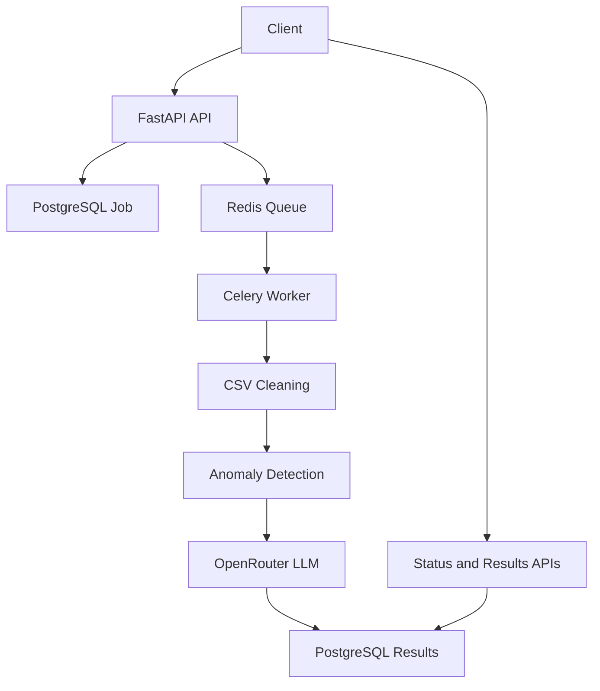

# AI-Powered Transaction Processing Pipeline

FastAPI backend for the Alemeno Backend + DevOps assignment. It accepts dirty transaction CSV uploads, processes them asynchronously with Celery, stores cleaned results in PostgreSQL, uses OpenRouter for LLM-assisted enrichment, and exposes polling APIs.

## Architecture



## Run

Create `.env` from `.env.example` and set `OPENROUTER_API_KEY` if you want live LLM calls. Without a key, jobs still complete with deterministic fallback summaries and `llm_failed=true` for missing-category rows.

```bash
docker compose up --build
```

API docs: `http://localhost:8000/docs`

## Example Requests

```bash
curl -X POST "http://localhost:8000/jobs/upload" \
  -F "file=@transactions.csv"
```

```bash
curl "http://localhost:8000/jobs/{job_id}/status"
```

```bash
curl "http://localhost:8000/jobs/{job_id}/results"
```

```bash
curl "http://localhost:8000/jobs?status=completed"
```

After Docker Compose is running, you can also run the smoke test:

```bash
python scripts/smoke_test.py
```

## Design Choices

- FastAPI gives typed request/response contracts and Swagger docs, matching the assignment stack.
- Celery + Redis keeps uploads responsive and makes retries/backoff natural.
- PostgreSQL stores job metadata, normalized transactions, anomaly flags, and report summaries.
- OpenRouter is isolated behind a service class so the provider can be swapped without changing the pipeline.
- LLM failures are non-fatal, as required: classification rows are marked `llm_failed`, and summaries fall back to deterministic reporting.

## Scale Review Notes

At 100x traffic, the first pressure points are local upload storage, API upload bandwidth, Celery queue depth, PostgreSQL connection pools, and OpenRouter rate limits. A production iteration should move uploads to object storage, stream CSV parsing, bulk insert rows, horizontally scale workers, add DB indexes and pooling, cache status responses, and add LLM circuit breakers/provider fallback.
